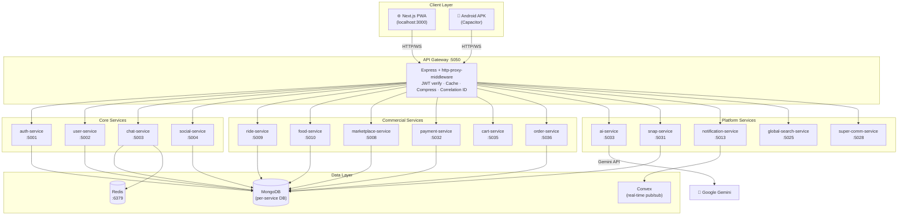

# 🚀 SuperApp — The Ultimate Everything Platform

<div align="center">

**"One App to rule them all. Chat, shop, ride, eat, work, and play in one unified ecosystem."**

[](https://nextjs.org)
[](https://nodejs.org)
[](https://www.mongodb.com/cloud/atlas)
[](https://tailwindcss.com)
[](https://docs.docker.com/compose)
[](./LICENSE)
[](./BUILDING_APK.md)

</div>

---

## 📑 Table of Contents

1. [Project Overview](#-project-overview)
2. [Inspired By](#-inspired-by-the-best)
3. [Feature Highlights](#-feature-highlights)
4. [Technology Stack — Backend](#-technology-stack--backend)
5. [Core Architecture](#-core-architecture)
6. [System Architecture Diagram](#-system-architecture-diagram)
7. [Backend Project Structure](#-backend-project-structure)
8. [Frontend Project Structure](#-frontend-project-structure)
9. [Database — MongoDB Collections](#-database--mongodb-collections)
10. [Security & JWT Authentication](#-security--jwt-authentication)
11. [Role-Based Access Control (RBAC)](#-role-based-access-control-rbac)
12. [CORS Configuration](#-cors-configuration)
13. [Error Handling](#-error-handling)
14. [All API Endpoints — Complete Reference](#-all-api-endpoints--complete-reference)
15. [PDF Generation (Invoice System)](#-pdf-generation-invoice-system)
16. [Data Flow — End to End](#-data-flow--end-to-end)
17. [All Microservices Reference](#%EF%B8%8F-all-microservices-reference)
18. [Running Locally — Setup Guide](#-running-locally--setup-guide)
19. [Environment Variables](#-environment-variables)
20. [Android APK Build](#-android-apk-build)
21. [Deployment](#-deployment)
22. [Contributing](#-contributing)
23. [License](#-license)

---

## 📖 Project Overview

SuperApp is a **production-ready, microservices-based super app** built for the Indian market. Instead of juggling 20 different apps, everything lives in one unified platform — chat, food delivery, ride hailing, marketplace, dating, professional networking, payments, and more.

The backend is composed of **40 independent Node.js/Express microservices**, each with its own MongoDB database. All traffic is routed through a single **API Gateway** (`port 5050`) that handles JWT verification, response caching, correlation IDs, and proxying.

The frontend is a **Next.js 16 App Router PWA** with 40+ pages, packaged as a native Android APK via Capacitor.

### 🌟 Inspired by the best

| App | Feature Borrowed |
|-----|-----------------|
| 💬 WhatsApp | Fast 1-to-1 & group chat with read receipts |
| 📢 Telegram | Broadcast channels and bots |
| 🎮 Discord | Community servers with roles & channels |
| 🚗 Uber / Ola | Real-time ride booking & driver tracking |
| 🛒 OLX | C2C marketplace for buying & selling |
| 🍔 Zomato / Swiggy | Restaurant browsing & food delivery |
| 💼 LinkedIn / GitHub | Professional profiles, job board & coding stats |
| 🟢 WeChat | Mini Apps ecosystem inside the main app |
| 👻 Snapchat | Disappearing messages & view-once media |

---

## ✨ Feature Highlights

<details>
<summary><b>💬 Chat System</b></summary>

- Private 1-to-1 messaging with read receipts (✓✓) and typing indicators
- WhatsApp-style groups & Discord-style community servers with roles
- Telegram-style broadcast channels
- Voice & Video calls (WebRTC)
- Hold-to-record voice notes with waveform playback
- Message reactions (👍❤️🔥), reply, forward, edit, delete
- Disappearing messages (24h / 7d) and View-Once media
</details>

<details>
<summary><b>🌍 Social Feed</b></summary>

- Unified feed mixing tweets, media posts, and Reddit-style threads
- Like, comment, repost, and upvote/downvote
- Story/status updates (Instagram-like)
</details>

<details>
<summary><b>🛍️ Marketplace</b></summary>

- List items with images, price, and location
- Buyer-seller negotiation chat rooms
- Order management and payment processing
</details>

<details>
<summary><b>🚖 Ride Hailing</b></summary>

- Rider mode (book rides) and Driver mode (earn money)
- Real-time driver matching via geo-location
- Earnings tracker for drivers
</details>

<details>
<summary><b>🍕 Food Delivery</b></summary>

- Browse restaurants and menus
- Live order tracking: Preparing → Picked up → Delivered
</details>

<details>
<summary><b>🤖 AI Features (Google Gemini)</b></summary>

- Chat summary: AI generates bullet-point summaries of long group chats
- Smart Reply: 3 contextual AI-generated reply suggestions
- `/ask` command: Ask anything in any chat
- Feed ranking and personalised recommendations
</details>

<details>
<summary><b>💳 Payments & Wallet</b></summary>

- UPI ID and QR code payment support
- Virtual wallet with top-up, transfer, refund
- Device binding for payment security
</details>

<details>
<summary><b>👨‍💻 Professional Profiles</b></summary>

- LinkedIn-style professional profiles with experience & education
- Job board: post, browse, and apply to jobs
- Connection requests and follower graph
</details>

<details>
<summary><b>🧩 Mini Apps</b></summary>

- Run games, tools, and utility apps inside SuperApp — no extra install
</details>

---

## 🛠️ Technology Stack — Backend

| Technology | Version | Purpose |
|------------|---------|---------|
| **Node.js** | 18+ | Runtime for all microservices |
| **Express.js** | 4.x | HTTP server framework per service |
| **MongoDB** | 6.0 (Docker) / Atlas | Primary database (separate DB per service) |
| **Mongoose** | 7.x | ODM — schema definition & validation |
| **Redis** | 7.0 | Session cache, rate limiting, pub/sub |
| **Socket.io** | 4.x | WebSocket server (chat & games) |
| **JSON Web Token (JWT)** | — | Stateless auth: `accessToken` (15 min) + `refreshToken` (7 days) |
| **bcryptjs** | — | Password hashing (salt rounds: 12) |
| **speakeasy** | — | TOTP 2FA (Google Authenticator compatible) |
| **Helmet** | — | Security headers (CSP, HSTS, etc.) |
| **http-proxy-middleware** | — | API Gateway reverse proxy |
| **apicache** | — | GET response caching at the gateway |
| **compression** | — | Gzip response compression |
| **morgan** | — | HTTP request logging |
| **dotenv** | — | Environment variable management |
| **Docker Compose** | — | Local orchestration of all services |
| **Convex** | — | Cloud real-time pub/sub & event streaming |
| **Google Gemini API** | — | AI: chat summaries, smart replies, ask AI |

### Frontend
| Technology | Purpose |
|------------|---------|
| **Next.js 16** (App Router) | Fast, SEO-friendly React framework |
| **Tailwind CSS 3.4** | Utility-first styling |
| **Zustand** | Global auth & app state |
| **React Query (@tanstack)** | Server state caching & sync |
| **Axios** | HTTP client with JWT interceptor |
| **Socket.io-client** | Real-time chat |
| **WebRTC** | Peer-to-peer audio/video |
| **Framer Motion** | Animations |
| **Capacitor** | Android / iOS APK packaging |

---

## 🏗️ Core Architecture

SuperApp uses a **microservices architecture** with a central API Gateway as the single entry point.

**Key design principles:**
- Each microservice owns its own MongoDB database — no shared schema
- All inter-service communication goes through HTTP (no direct DB access between services)
- The API Gateway handles authentication — downstream services trust the `X-User-Id` header
- Correlation IDs (`X-Correlation-Id`) are propagated through every request for distributed tracing
- GET responses at the gateway layer are cached with `apicache` (30-second TTL)
- WebSocket connections (`ws: true`) for chat and games are proxied directly to the appropriate service

```
Client  ──(HTTPS / WSS)──►  API Gateway :5050
                                │
                    ┌───────────┼──────────────┐
                    ▼           ▼              ▼
              JWT verify    Rate limit    Cache (GET)
                    │           │              │
                    └───────────┴──────────────┘
                                │
              ┌─────────────────┼─────────────────┐
              ▼                 ▼                 ▼
        auth-service      user-service      chat-service
          :5001              :5002              :5003
          MongoDB            MongoDB        MongoDB+Redis
                                             +Socket.io
```

---

## 🗺️ System Architecture Diagram



---

## 📂 Backend Project Structure

```
Super-App-Core/
│
├── api-gateway/                       # Single entry point for all traffic
│   ├── index.js                       # Express app: CORS, Helmet, JWT, proxy rules
│   ├── Dockerfile
│   └── package.json
│
├── services/                          # 40 independent microservices
│   │
│   ├── auth-service/          :5001   # Identity & authentication
│   │   ├── config/
│   │   ├── controllers/
│   │   │   └── authController.js      # signup, login, 2FA, QR-login, refresh, logout
│   │   ├── models/
│   │   │   └── User.js                # email, password (bcrypt), role, 2FA, sessions
│   │   ├── routes/
│   │   │   └── authRoutes.js
│   │   ├── utils/
│   │   │   ├── authMiddleware.js      # Bearer token verification
│   │   │   └── errors.js             # AppError class + handleErrors middleware
│   │   └── index.js
│   │
│   ├── user-service/          :5002   # Public user profiles
│   │   ├── models/
│   │   │   ├── User.js                # name, bio, avatar, followers, KYC
│   │   │   └── UserSettings.js
│   │   └── ...
│   │
│   ├── chat-service/          :5003   # Real-time messaging
│   │   ├── models/
│   │   │   ├── Chat.js                # 1-to-1 & group chat rooms
│   │   │   └── Message.js             # content, reactions, reply, view-once
│   │   └── ...
│   │
│   ├── social-service/        :5004   # Social feed & interactions
│   │   ├── models/
│   │   │   ├── Post.js                # text/media/poll posts
│   │   │   ├── UnifiedPost.js         # cross-type unified feed
│   │   │   ├── Comment.js
│   │   │   └── Story.js
│   │   └── ...
│   │
│   ├── professional-service/  :5006   # LinkedIn-style profiles & jobs
│   │   ├── models/
│   │   │   ├── ProfessionalProfile.js # headline, skills, experience, education
│   │   │   ├── Connection.js
│   │   │   ├── Job.js
│   │   │   └── Application.js
│   │   └── ...
│   │
│   ├── dating-service/        :5007   # Dating & matching
│   ├── marketplace-service/   :5008   # C2C listings & wholesale
│   │   └── models/ (Product, WholesaleListing, Review...)
│   │
│   ├── ride-service/          :5009   # Ride hailing
│   ├── food-service/          :5010   # Food delivery + table booking
│   ├── productivity-service/  :5011   # Tasks, notes, calendar
│   ├── mini-app-service/      :5012   # Mini-app registry
│   ├── notification-service/  :5013   # Push notifications via Convex
│   ├── dashboard-service/     :5024   # User dashboards
│   ├── global-search-service/ :5025   # Multi-service search
│   ├── monetization-service/  :5026   # Creator economy + invoice PDF
│   ├── settings-service/      :5027   # Privacy & preferences
│   │
│   ├── super-communication-service/ :5028  # Discord-like servers/channels
│   │   ├── middleware/
│   │   │   └── rbac.js               # requirePermission() guard
│   │   ├── models/
│   │   │   ├── Server.js  Channel.js  Role.js  UserRole.js
│   │   │   ├── AuditLog.js  Poll.js  SuperMessage.js
│   │   │   └── ...
│   │   └── ...
│   │
│   ├── advanced-interactions-service/ :5029
│   ├── snap-service/          :5031   # Snapchat-like ephemeral media
│   │   ├── models/
│   │   │   ├── Snap.js               # viewOnce, TTL, screenshot detection
│   │   │   ├── Memory.js             # AES-encrypted media vault
│   │   │   ├── Streak.js  StoryAudience.js  UserLocation.js
│   │   │   └── ScreenshotEvent.js
│   │   └── ...
│   │
│   ├── payment-service/       :5032   # UPI wallet & QR payments
│   │   ├── models/
│   │   │   ├── PaymentProfile.js     # UPI ID, wallet balance, device binding
│   │   │   └── Transaction.js
│   │   └── ...
│   │
│   ├── ai-service/            :5033   # Google Gemini integration
│   ├── business-dashboard-service/ :5034
│   ├── cart-service/          :5035
│   ├── order-service/         :5036
│   ├── developer-platform-service/ :5038
│   ├── hotel-service/         :5021
│   ├── discord-service/       (port TBD)
│   ├── community-service/     (port TBD)
│   ├── economy-service/       (port TBD)
│   ├── game-service/          (port TBD)
│   ├── story-service/         (port TBD)
│   ├── group-chat-service/    (port TBD)
│   ├── facebook-service/      (port TBD)
│   ├── analytics-service/     (port TBD)
│   └── aggregator-service/    (port TBD)
│
├── frontend/                          # Next.js 16 PWA (see Frontend section)
├── frontend-core/                     # Shared core API wrappers
├── convex/                            # Real-time schema & cloud functions
├── k8s/                               # Kubernetes manifests
├── scripts/                           # Seed data, load tests
├── docker-compose.yml                 # One-command local dev
├── start-app.mjs                      # Master startup script (Node.js)
├── Dockerfile.node                    # Base Node image
└── BUILDING_APK.md                    # Android APK build guide
```

---

## 🖥️ Frontend Project Structure

```
frontend/
│
├── app/                               # Next.js App Router pages
│   ├── layout.tsx                     # Root layout (Navbar, Providers)
│   ├── page.tsx                       # Home / landing
│   │
│   ├── login/                         # Email login
│   │   └── qr/                        # QR-code scan login (WeChat-style)
│   ├── register/                      # New account creation
│   ├── forgot-password/
│   ├── onboarding/                    # First-run profile setup
│   │
│   ├── chat/                          # Messaging hub
│   │   ├── [id]/                      # Individual chat room
│   │   ├── group/                     # Group chats
│   │   └── super/                     # Super-communication channels
│   ├── calls/                         # Voice & video calls (WebRTC)
│   ├── channels/
│   │   └── [channelId]/
│   ├── snaps/                         # Snapchat-style ephemeral media
│   ├── status/                        # Story / status updates
│   │
│   ├── feed/                          # Unified social feed
│   ├── explore/                       # Discover content & people
│   ├── live/                          # Live streaming
│   │
│   ├── marketplace/                   # C2C buy/sell
│   │   ├── [id]/                      # Product detail
│   │   ├── cart/
│   │   ├── sell/
│   │   ├── manage/
│   │   └── orders/
│   ├── food/                          # Food ordering
│   │   └── orders/
│   ├── rides/                         # Ride hailing
│   │   └── jobs/                      # Driver job board
│   ├── services/                      # Extra services hub
│   │   ├── hotel/
│   │   └── table-booking/
│   │
│   ├── wallet/                        # Payments & UPI
│   ├── dating/                        # Dating & matching
│   ├── professional/                  # Professional profile & jobs
│   ├── coding/                        # Coding stats & practice
│   │
│   ├── tasks/                         # Productivity — task manager
│   ├── notes/                         # Personal notes
│   ├── calendar/                      # Calendar view
│   ├── forms/                         # Dynamic form builder
│   │
│   ├── apps/                          # Mini Apps launcher
│   │   └── games/
│   ├── random-chat/                   # Anonymous random chat
│   │
│   ├── u/[username]/                  # Public user profile
│   ├── notifications/
│   ├── settings/
│   ├── business-dashboard/
│   └── offline/                       # Offline fallback (PWA)
│
├── components/                        # Reusable UI components
│   ├── ui/                            # Design system (buttons, modals, cards…)
│   ├── chat/                          # ChatBubble, MessageInput, ReactionBar…
│   ├── profile/                       # Avatar, ProfileCard, KYCBadge…
│   └── snaps/                         # SnapViewer, SnapCamera…
│
├── services/                          # Axios API client wrappers
│   ├── api.ts                         # Base axios instance (JWT interceptor)
│   └── authApi.ts                     # Auth-specific API calls
│
├── store/                             # Zustand global state
│   └── useAuthStore.ts                # user, token, login(), logout()
│
├── hooks/                             # Custom React hooks
│   ├── useAuth.ts
│   └── usePermissions.ts
│
├── lib/                               # Utilities & helpers
├── utils/                             # Date formatters, validators…
├── public/                            # Static assets (icons, manifest.json)
├── capacitor.config.ts                # Android/iOS native packaging config
└── next.config.js                     # Next.js config (image domains, redirects)
```

---

## 🗄️ Database — MongoDB Collections

Each microservice maintains its own isolated MongoDB database. Below are the primary collections:

### `superapp_auth` — auth-service
| Collection | Key Fields |
|------------|------------|
| **users** | `email`, `password` (bcrypt, 12 rounds), `role` (user/moderator/admin), `loginAttempts`, `lockUntil`, `refreshTokens[]`, `twoFactorEnabled`, `twoFactorSecret`, `activeSessions[]` |

### `superapp_users` — user-service
| Collection | Key Fields |
|------------|------------|
| **users** | `userId`, `name`, `bio`, `avatar`, `coverPhoto`, `isVerified`, `kycStatus`, `kycDocuments[]`, `username`, `followers[]`, `following[]`, `blocked[]` |
| **usersettings** | `userId`, notification prefs, privacy settings |

### `superapp_chat` — chat-service
| Collection | Key Fields |
|------------|------------|
| **chats** | `participants[]`, `isGroupChat`, `groupName`, `latestMessage`, `isAnonymous` |
| **messages** | `chatId`, `senderId`, `content`, `reactions[]`, `replyTo`, `isViewOnce`, `isViewed`, `disappearsAt` |

### `superapp_social` — social-service
| Collection | Key Fields |
|------------|------------|
| **posts** | `authorId`, `content`, `mediaUrls[]`, `type` (text/media/poll/thread), `likes[]`, `upvotes`, `downvotes`, `awards[]` |
| **unifiedposts** | Cross-type feed aggregation |
| **comments** | `postId`, `authorId`, `content`, `votes` |
| **stories** | `userId`, `mediaUrl`, `expiresAt`, `viewers[]` |

### `superapp_payments` — payment-service
| Collection | Key Fields |
|------------|------------|
| **paymentprofiles** | `userId`, `upiId`, `walletBalance`, `coinBalance`, `bindedDevices[]` |
| **transactions** | `senderId`, `receiverId`, `amount`, `type` (transfer/topup/refund/qr/merchant), `status` |

### `superapp_snap` — snap-service
| Collection | Key Fields |
|------------|------------|
| **snaps** | `senderId`, `receiverId`, `mediaUrl`, `mediaType`, `ttlSeconds`, `viewOnce`, `isViewed`, `replayCount`, `expiresAt` (TTL index) |
| **memories** | `userId`, `encryptedBlob` (AES), `iv`, `tag`, `locationMeta`, `isPinned` |
| **screenshotevents** | `snapId`, `byUserId`, `eventType` |
| **storyaudiences** | `userId`, `blockedUserIds[]`, `trustedUserIds[]`, `defaultVisibility` |
| **userlocations** | `userId`, lat/lng for Snap Map |
| **streaks** | `userIds[]`, `count`, `lastSnapAt` |

### `superapp_marketplace` — marketplace-service
| Collection | Key Fields |
|------------|------------|
| **products** | `sellerId`, `title`, `price`, `images[]`, `category`, `status`, `wishlistedBy[]` |
| **reviews** | `productId`, `reviewerId`, `rating`, `helpfulVotes` |

### `superapp_professional` — professional-service
| Collection | Key Fields |
|------------|------------|
| **professionalprofiles** | `userId`, `headline`, `skills[]`, `experience[]`, `education[]` |
| **connections** | `fromUserId`, `toUserId`, `status` |
| **jobs** | `postedBy`, `title`, `description`, `skills[]`, `location` |
| **applications** | `jobId`, `applicantId`, `status` |

### `superapp_super_comm` — super-communication-service
| Collection | Key Fields |
|------------|------------|
| **servers** | `name`, `ownerId`, `icon`, `members[]` |
| **channels** | `serverId`, `name`, `type` (text/voice/announcement) |
| **roles** | `targetId`, `name`, `level`, `permissions[]`, `color` |
| **userroles** | `userId`, `targetId`, `roleId` |
| **auditlogs** | `targetId`, `actorId`, `action`, `details` |
| **polls** | `channelId`, `question`, `options[]`, `votes` |

---

## 🔐 Security & JWT Authentication

### Token Strategy

The system uses a **dual-token pattern**:

| Token | Expiry | Storage | Purpose |
|-------|--------|---------|---------|
| `accessToken` | 15 minutes | Memory / `Authorization: Bearer` header | API request auth |
| `refreshToken` | 7 days | `httpOnly` cookie | Silent token refresh |

```
POST /api/auth/login
  → Returns: { token: <accessToken> }
  → Sets cookie: refreshToken (httpOnly, secure in prod)

POST /api/auth/refresh
  → Reads: refreshToken cookie
  → Returns: new accessToken
```

### Token Payload

```json
{
  "id": "<userId>",
  "email": "user@example.com",
  "role": "user",
  "jti": "<uuid-v4>"
}
```

### Gateway-Level Verification

The API Gateway verifies the JWT **before** proxying to any protected service. On success it injects:

```
X-User-Id: <userId>          ← trusted by all downstream services
X-Correlation-Id: <uuid>     ← for distributed tracing
```

### Brute-Force Protection

- **5 failed logins** → account locked for **2 hours** (`lockUntil` field)
- Login attempts counter resets on successful login

### Two-Factor Authentication (2FA)

Built with `speakeasy` (TOTP — Google Authenticator compatible):

```
POST /api/auth/2fa/setup     → returns QR code URI
POST /api/auth/2fa/verify    → activates 2FA
POST /api/auth/2fa/login-verify → verifies TOTP code on login
```

### QR-Code Login (WeChat-style)

```
POST /api/auth/qr-login/generate  → create session token + QR
GET  /api/auth/qr-login/status/:token → poll for confirmation
POST /api/auth/qr-login/confirm   → confirm from authenticated device
```

### Password Security

- `bcryptjs` with **12 salt rounds**
- Passwords never returned in API responses
- Cookie options: `httpOnly: true`, `secure: true` (production), `sameSite: 'None'` (production) / `'Lax'` (development)

---

## 👮 Role-Based Access Control (RBAC)

RBAC is implemented at two levels:

### 1. System Roles (Auth Service)

Defined on the `User` model in `auth-service`:

| Role | Description |
|------|-------------|
| `user` | Default — standard access |
| `moderator` | Content moderation privileges |
| `admin` | Full platform access |

The role is embedded in the JWT payload so the gateway and services can make coarse-grained decisions without a DB lookup.

### 2. Context Roles (Super-Communication Service)

Fine-grained permission system for servers and channels, modelled after Discord:

```
Role {
  targetId      // server or channel ID
  targetType    // 'server' | 'channel'
  name          // e.g. "Admin", "Moderator", "Member"
  level         // 0 = owner (bypasses all checks)
  permissions[] // e.g. ['manage_roles', 'send_messages', 'view_audit_log']
  color         // hex color for UI display
}

UserRole {
  userId
  targetId
  roleId  → Role
}
```

The `requirePermission(permission)` Express middleware:

```js
// routes/roleRoutes.js
router.post('/',        requirePermission('manage_roles'),    roleController.createRole);
router.post('/assign',  requirePermission('manage_roles'),    roleController.assignRole);
router.get('/:targetId/audit', requirePermission('view_audit_log'), roleController.getAuditLogs);
```

Every role assignment and creation is written to an immutable `AuditLog` collection.

---

## 🌐 CORS Configuration

CORS is configured at **two layers**:

### API Gateway (`api-gateway/index.js`)

```js
app.use(cors({
  origin: true,          // reflects requesting origin (dev-friendly)
  credentials: true,     // allow cookies (refresh token)
  methods: ['GET', 'POST', 'PUT', 'PATCH', 'DELETE', 'OPTIONS'],
  allowedHeaders: ['Content-Type', 'Authorization', 'X-Correlation-Id']
}));
```

### Individual Services (`services/*/index.js`)

```js
app.use(cors({
  origin: process.env.CORS_ORIGIN || true,
  credentials: true
}));
```

> **Production note:** Set `CORS_ORIGIN=https://your-frontend-domain.com` in each service's environment to restrict cross-origin access.

---

## ⚠️ Error Handling

All services share a consistent error pattern via `utils/errors.js`.

### `AppError` Class

```js
class AppError extends Error {
  constructor(message, statusCode) {
    super(message);
    this.statusCode = statusCode;
    this.status = statusCode.toString().startsWith('4') ? 'fail' : 'error';
    this.isOperational = true;
  }
}
```

### Global Error Handler (`handleErrors` middleware)

```js
app.use(handleErrors);  // registered last in every service
```

**Response shape:**

```json
{
  "status": "fail",
  "correlationId": "550e8400-e29b-41d4-a716-446655440000",
  "message": "Invalid credentials",
  "stack": "..."    // only in NODE_ENV=development
}
```

### HTTP Status Codes Used

| Code | Meaning |
|------|---------|
| `200` | OK |
| `201` | Created |
| `400` | Bad Request / Validation Error |
| `401` | Unauthenticated (no/expired token) |
| `403` | Forbidden (wrong role/permission) |
| `404` | Resource Not Found |
| `500` | Internal Server Error |

### Gateway Error Codes

The API Gateway uses machine-readable error codes:

| Code | Meaning |
|------|---------|
| `ACCESS_DENIED` | No token provided |
| `INVALID_TOKEN` | JWT expired or malformed |

---

## 📡 All API Endpoints — Complete Reference

All requests go through the gateway at `http://localhost:5050`. Protected routes require `Authorization: Bearer <accessToken>`.

### 🔐 Auth — `/api/auth` (public)

| Method | Endpoint | Description |
|--------|----------|-------------|
| POST | `/api/auth/signup` | Register new user |
| POST | `/api/auth/login` | Login → accessToken + refreshToken cookie |
| POST | `/api/auth/refresh` | Refresh accessToken using cookie |
| POST | `/api/auth/logout` | Invalidate refresh token |
| POST | `/api/auth/2fa/setup` | Generate TOTP QR code |
| POST | `/api/auth/2fa/verify` | Enable 2FA |
| POST | `/api/auth/2fa/disable` | Disable 2FA |
| POST | `/api/auth/2fa/login-verify` | Verify TOTP code on login |
| GET  | `/api/auth/2fa/status` | Check 2FA enabled state |
| POST | `/api/auth/qr-login/generate` | Generate QR login session |
| POST | `/api/auth/qr-login/confirm` | Confirm QR scan |
| GET  | `/api/auth/qr-login/status/:token` | Poll QR login status |

### 👤 Users — `/api/users` 🔒

| Method | Endpoint | Description |
|--------|----------|-------------|
| GET | `/api/users/:userId` | Get user profile |
| PUT | `/api/users/:userId` | Update profile |

### 💬 Chat — `/api/chats` 🔒

| Method | Endpoint | Description |
|--------|----------|-------------|
| POST | `/api/chats/` | Access or create 1-to-1 chat |
| GET  | `/api/chats/` | Get all chats for current user |
| POST | `/api/chats/group` | Create group chat |
| POST | `/api/chats/reveal-identity` | Reveal identity in anonymous chat |
| POST | `/api/chats/message` | Send a message |
| GET  | `/api/chats/message/:chatId` | Get chat history |
| PUT  | `/api/chats/message/react` | React to a message |

### 🌍 Social — `/api/social` 🔒

| Method | Endpoint | Description |
|--------|----------|-------------|
| POST | `/api/social/posts` | Create post (text/media/poll) |
| GET  | `/api/social/posts/:postId/comments` | Get comments |
| GET  | `/api/social/posts/user/:userId` | Get user's posts |
| POST | `/api/social/posts/like` | Like/unlike a post |
| POST | `/api/social/posts/vote-post` | Reddit-style upvote/downvote |
| POST | `/api/social/posts/award` | Give post an award |
| POST | `/api/social/posts/comment` | Add comment |
| POST | `/api/social/posts/comment/vote` | Vote on comment |
| POST | `/api/social/posts/repost` | Repost |
| POST | `/api/social/posts/report` | Report post |
| POST | `/api/social/posts/delete` | Delete post |

### 🚖 Rides — `/api/rides` 🔒

| Method | Endpoint | Description |
|--------|----------|-------------|
| POST  | `/api/rides/book` | Book a ride |
| POST  | `/api/rides/estimates` | Get fare estimates |
| GET   | `/api/rides/history/:userId` | Ride history |
| GET   | `/api/rides/active/:userId` | Active ride |
| GET   | `/api/rides/pending` | Pending rides (driver view) |
| PATCH | `/api/rides/status` | Update ride status |
| PATCH | `/api/rides/:rideId/accept` | Driver accepts ride |
| PATCH | `/api/rides/:rideId/reject` | Driver rejects ride |

### 🍕 Food — `/api/food` 🔒

| Method | Endpoint | Description |
|--------|----------|-------------|
| GET   | `/api/food/restaurants` | List restaurants |
| GET   | `/api/food/restaurants/:id` | Restaurant details |
| POST  | `/api/food/restaurants` | Add restaurant |
| POST  | `/api/food/restaurants/review` | Add review |
| POST  | `/api/food/restaurants/table-bookings` | Book a table |
| POST  | `/api/food/orders` | Place food order |
| PATCH | `/api/food/orders/status` | Update order status |
| GET   | `/api/food/orders/history/:userId` | Order history |
| GET   | `/api/food/orders/active/:userId` | Active orders |

### 💳 Payments / Wallet — `/api/wallet` 🔒

| Method | Endpoint | Description |
|--------|----------|-------------|
| POST | `/api/wallet/profile` | Create payment profile |
| GET  | `/api/wallet/profile/:userId` | Get wallet & UPI info |
| POST | `/api/wallet/transfer` | P2P money transfer |
| POST | `/api/wallet/topup` | Add money to wallet |
| POST | `/api/wallet/qr/generate` | Generate QR for payment |
| POST | `/api/wallet/qr/pay` | Pay via QR |
| POST | `/api/wallet/merchant/pay` | Merchant payment |
| POST | `/api/wallet/refund` | Initiate refund |
| POST | `/api/wallet/device/bind` | Bind device for security |
| GET  | `/api/wallet/transactions/:userId` | Transaction history |

### 🛍️ Marketplace — `/api/marketplace` 🔒

| Method | Endpoint | Description |
|--------|----------|-------------|
| GET   | `/api/marketplace/products` | Browse listings |
| GET   | `/api/marketplace/products/:id` | Product details |
| POST  | `/api/marketplace/products` | Create listing |
| PATCH | `/api/marketplace/products/:id/status` | Update listing status |
| POST  | `/api/marketplace/products/:id/wishlist` | Toggle wishlist |
| POST  | `/api/marketplace/products/:id/reviews` | Add review |
| GET   | `/api/marketplace/products/:id/reviews` | Get reviews |

### 🤖 AI — `/api/ai` 🔒

| Method | Endpoint | Description |
|--------|----------|-------------|
| POST | `/api/ai/summarize` | Summarize a chat conversation |
| POST | `/api/ai/reply` | Get 3 smart reply suggestions |
| POST | `/api/ai/ask` | Ask the AI anything |
| POST | `/api/ai/recommend` | Get personalised recommendations |
| POST | `/api/ai/rank-feed` | Re-rank social feed |

### 🔍 Search — `/api/search` 🔒

| Method | Endpoint | Description |
|--------|----------|-------------|
| GET | `/api/search?q=...` | Global search across services |

### 👻 Snaps — `/api/snaps` 🔒

| Method | Endpoint | Description |
|--------|----------|-------------|
| POST  | `/api/snaps/send` | Send a snap |
| GET   | `/api/snaps/inbox` | Get received snaps |
| POST  | `/api/snaps/:id/open` | Open/view a snap |
| POST  | `/api/snaps/:id/replay` | Replay a snap |
| PATCH | `/api/snaps/screenshot/:snapId` | Mark screenshot taken |
| POST  | `/api/snaps/memories` | Save to encrypted memories |
| GET   | `/api/snaps/memories/:userId` | Get memories |
| DELETE| `/api/snaps/memories/:memoryId` | Delete memory |
| POST  | `/api/snaps/location` | Update Snap Map location |
| GET   | `/api/snaps/locations` | Get nearby users on map |

### 💼 Professional — `/api/professional` 🔒

| Method | Endpoint | Description |
|--------|----------|-------------|
| POST | `/api/professional/profile` | Create/update profile |
| GET  | `/api/professional/profile/:userId` | Get professional profile |
| POST | `/api/professional/connect` | Send connection request |
| POST | `/api/professional/connect/respond` | Accept/reject request |
| GET  | `/api/professional/connections/:userId` | Get connections |
| POST | `/api/professional/jobs` | Post a job |
| GET  | `/api/professional/jobs` | Browse jobs |
| POST | `/api/professional/jobs/apply` | Apply to job |
| GET  | `/api/professional/jobs/:jobId/applications` | View applications |

### 🛒 Cart — `/api/cart` 🔒 · Orders — `/api/orders` 🔒

| Service | Method | Endpoint | Description |
|---------|--------|----------|-------------|
| Cart   | POST | `/api/cart/...` | Manage shopping cart |
| Orders | POST | `/api/orders/place` | Place order |
| Orders | GET  | `/api/orders/:id` | Order details |
| Orders | GET  | `/api/orders/user/:userId` | User order history |
| Orders | PATCH| `/api/orders/:id/status` | Update order status |
| Orders | POST | `/api/orders/:id/cancel` | Cancel order |
| Orders | GET  | `/api/orders/track/:trackingNumber` | Track shipment |

### 🔔 Notifications — `/api/notifications` 🔒
### ⚙️ Settings — `/api/settings` 🔒
### 📊 Dashboard — `/api/dashboard` 🔒
### 📡 Super Communication — `/api/super-comm` 🔒 (WebSocket)
### 🎮 Games — `/api/games` 🔒 (WebSocket)
### 🏨 Hotels — `/api/hotels` 🔒
### 💘 Dating — `/api/dating` 🔒
### 🧩 Mini Apps — `/api/mini-apps` 🔒
### 💼 Business Dashboard — `/api/business-dashboard` 🔒

---

## 📄 PDF Generation (Invoice System)

The **monetization-service** generates business invoices. The current implementation computes all financial fields and records the result in MongoDB, with the PDF URL pointing to a CDN-hosted document.

**Flow:**

```
POST /api/monetization/invoices
  Body: { businessId, customerId, transactionId, items[], taxRate }
  
  1. Auto-calculate: subtotal, taxAmount (18% GST default), grandTotal
  2. Generate enterprise invoice number: INV-{BIZ}-{random hex}
  3. Render PDF (pdfkit / puppeteer) → upload to CDN
  4. Save Invoice document to MongoDB
  5. Return: { invoiceNumber, pdfUrl, grandTotal, ... }
```

**Invoice model fields:** `invoiceNumber`, `items[]` (qty, unitPrice, total), `subtotal`, `taxRate`, `taxAmount`, `grandTotal`, `status`, `pdfUrl`, `dueDate` (net-15)

---

## 🔄 Data Flow — End to End

### Example: User sends a chat message

```
1. Frontend (Next.js)
   └─ Socket.io emit("sendMessage", { chatId, content })
         │
         ▼
2. API Gateway :5050
   ├─ Reads JWT from Authorization header or cookie
   ├─ Verifies signature against JWT_SECRET
   ├─ Injects X-User-Id into request headers
   └─ Proxies WebSocket to chat-service:5003
         │
         ▼
3. chat-service :5003
   ├─ Receives socket event
   ├─ Saves Message document → MongoDB (superapp_chat)
   ├─ Updates Chat.latestMessage
   └─ Broadcasts to all room participants via Socket.io
         │
         ▼
4. Recipients' browsers
   └─ Socket.io on("newMessage") → React state update → UI renders bubble
```

### Example: Book a ride

```
1. Frontend → POST /api/rides/book  { pickup, dropoff, vehicleType }
2. Gateway  → JWT check → proxy to ride-service:5009
3. ride-service → save Ride doc (status: "pending") → MongoDB
4. Gateway  → 201 { rideId, estimatedFare }
5. Driver app polling GET /api/rides/pending
6. Driver   → PATCH /api/rides/:rideId/accept
7. ride-service → update Ride.status = "accepted"
8. Rider    → polling GET /api/rides/active/:userId → status update in UI
```

---

## ⚙️ All Microservices Reference

| Service | Port | Description |
|---------|------|-------------|
| auth-service | 5001 | JWT login/register, 2FA, QR-login, refresh/logout |
| user-service | 5002 | Public profiles, KYC, follower graph |
| chat-service | 5003 | 1-to-1 + group chat, Socket.io, reactions |
| social-service | 5004 | Feed, posts, polls, comments, upvotes, reposts |
| professional-service | 5006 | Profiles, connections, job board |
| dating-service | 5007 | Dating profiles, matching algorithm |
| marketplace-service | 5008 | C2C listings, reviews, wholesale |
| ride-service | 5009 | Ride booking, fare estimates, driver matching |
| food-service | 5010 | Restaurants, menus, orders, table booking |
| productivity-service | 5011 | Tasks, notes, calendar |
| mini-app-service | 5012 | Mini app registry |
| notification-service | 5013 | Push notifications via Convex |
| hotel-service | 5021 | Hotel discovery & booking |
| dashboard-service | 5024 | Aggregated user dashboards |
| global-search-service | 5025 | Cross-service unified search |
| monetization-service | 5026 | Creator economy, invoices |
| settings-service | 5027 | Privacy, notification, account settings |
| super-communication-service | 5028 | Discord-like servers, channels, RBAC |
| advanced-interactions-service | 5029 | Extended reactions & message actions |
| snap-service | 5031 | Ephemeral media, Snap Map, Memories |
| payment-service | 5032 | UPI, wallet, QR payments, transactions |
| ai-service | 5033 | Gemini: summarise, smart reply, ask AI, feed rank |
| business-dashboard-service | 5034 | Seller & driver analytics |
| cart-service | 5035 | Shopping cart management |
| order-service | 5036 | Order processing & shipment tracking |
| developer-platform-service | 5038 | Developer tools & API management |
| advanced-dating-service | — | Enhanced matching & discovery |
| advanced-food-service | — | Advanced food features |
| advanced-marketplace-service | — | Bulk/wholesale marketplace |
| advanced-miniapp-service | — | Mini app sandbox |
| advanced-ride-service | — | Advanced ride features |
| aggregator-service | — | Cross-service data aggregation |
| analytics-service | — | Usage analytics & metrics |
| community-service | — | Community management |
| discord-service | — | Discord-style server implementation |
| economy-service | — | Gig economy & freelancing |
| facebook-service | — | Facebook-style social features |
| game-service | — | In-app games (WebSocket) |
| group-chat-service | — | Advanced group chat |
| story-service | — | Stories & status updates |

---

## 🚀 Running Locally — Setup Guide

### Prerequisites

| Requirement | Version | Notes |
|-------------|---------|-------|
| Node.js | 18+ | Required for all services |
| Docker + Docker Compose | Latest | Recommended for full stack |
| MongoDB Atlas | Free tier | Or use local Docker MongoDB |
| Git | Any | For cloning |

### Option A: Docker Compose (Recommended ✅)

The fastest way to run the full stack. Spins up MongoDB, Redis, API Gateway, and all services in one command.

```bash
# 1. Clone the repository
git clone https://github.com/your-username/Super-App-Core.git
cd Super-App-Core

# 2. Configure environment variables
cp .env.example .env
# Edit .env — set:
#   JWT_SECRET=<strong-random-string>
#   MONGO_URI=mongodb://mongodb:27017/superapp  (or Atlas URI)
#   GEMINI_API_KEY=<your-key>

# 3. Start everything
docker-compose up --build

# 4. Seed sample data (optional)
node seed-production-data.mjs
```

Open `http://localhost:3000` in your browser.

### Option B: Manual Setup (without Docker)

Use this when you want to run only specific services.

```bash
# 1. Clone
git clone https://github.com/your-username/Super-App-Core.git
cd Super-App-Core

# 2. Install and start the frontend
cd frontend
npm install
npm run dev           # → http://localhost:3000

# 3. Install and start the API Gateway
cd ../api-gateway
npm install
cp .env.example .env  # set JWT_SECRET + service URLs
node index.js         # → http://localhost:5050

# 4. Install and start core services (repeat for each)
cd ../services/auth-service
npm install
echo "PORT=5001\nMONGO_URI=...\nJWT_SECRET=..." > .env
node index.js

cd ../services/user-service && npm install && node index.js
cd ../services/chat-service && npm install && node index.js
# ... continue for services you need

# 5. Or use the master startup script (starts all services)
cd ../..
node start-app.mjs
```

### Running Ports Overview

| Service | URL |
|---------|-----|
| 🌐 Frontend | `http://localhost:3000` |
| 🚪 API Gateway | `http://localhost:5050` |
| 🔐 Auth | `http://localhost:5001` |
| 👤 Users | `http://localhost:5002` |
| 💬 Chat | `http://localhost:5003` |
| 🌍 Social | `http://localhost:5004` |
| 💼 Professional | `http://localhost:5006` |
| 💘 Dating | `http://localhost:5007` |
| 🛍️ Marketplace | `http://localhost:5008` |
| 🚖 Rides | `http://localhost:5009` |
| 🍕 Food | `http://localhost:5010` |
| 💳 Payment | `http://localhost:5032` |
| 🤖 AI | `http://localhost:5033` |
| 🗄️ MongoDB | `mongodb://localhost:27017` |
| 🔴 Redis | `redis://localhost:6379` |

---

## 🔐 Environment Variables

### API Gateway (`.env`)

```env
PORT=5050
JWT_SECRET=your_super_secret_key_here

AUTH_SERVICE_URL=http://localhost:5001
USER_SERVICE_URL=http://localhost:5002
CHAT_SERVICE_URL=http://localhost:5003
SOCIAL_SERVICE_URL=http://localhost:5004
RIDE_SERVICE_URL=http://localhost:5009
FOOD_SERVICE_URL=http://localhost:5010
PAYMENT_SERVICE_URL=http://localhost:5032
AI_SERVICE_URL=http://localhost:5033
# ... (see docker-compose.yml for full list)
```

### Each Service (`.env`)

```env
PORT=5001                              # unique per service
MONGO_URI=mongodb+srv://<user>:<pass>@cluster0.mongodb.net/superapp_auth
JWT_SECRET=your_super_secret_key_here  # MUST match gateway
JWT_REFRESH_SECRET=your_refresh_secret
REDIS_URL=redis://localhost:6379       # chat-service only
NODE_ENV=production                    # or development
CORS_ORIGIN=https://yourapp.com        # optional, defaults to *
```

### Frontend (`.env.local`)

```env
NEXT_PUBLIC_API_URL=http://localhost:5050/api
NEXT_PUBLIC_CONVEX_URL=https://your-convex-url.convex.cloud
```

### AI Service (`.env`)

```env
GEMINI_API_KEY=your_gemini_api_key_here
```

---

## 📱 Android APK Build

SuperApp can be packaged as a native Android APK using **Capacitor**.

```bash
cd frontend
npm install
npm run build:export      # Build & export Next.js as static HTML
npx cap add android       # Add Android platform (first time only)
npx cap sync android      # Sync web assets to Android project
npx cap open android      # Open Android Studio to build the APK
```

> **Full step-by-step guide** → [`BUILDING_APK.md`](./BUILDING_APK.md)

---

## 🚀 Deployment

### Frontend → [Vercel](https://vercel.com)
1. Connect your GitHub repo on Vercel.
2. Set **Root Directory** to `frontend`.
3. Add environment variable: `NEXT_PUBLIC_API_URL = https://your-gateway.onrender.com/api`
4. Deploy!

### Backend → [Render](https://render.com) or [Railway](https://railway.app)
1. Create one **Web Service** per microservice (start with `api-gateway` + core services).
2. Set `MONGO_URI`, `JWT_SECRET`, and other vars in the dashboard.
3. Copy the API Gateway live URL to your frontend env var.

### Database → [MongoDB Atlas](https://www.mongodb.com/cloud/atlas)
1. Create a free cluster.
2. Add database user + allow all IPs (`0.0.0.0/0`).
3. Copy the connection string as `MONGO_URI`.

### Kubernetes (Production Scale)
Kubernetes manifests are available in the `/k8s/` directory for deploying the full stack to a managed cluster (GKE, EKS, AKS).

---

## 🤝 Contributing

1. **Fork** this repository
2. **Clone** your fork: `git clone https://github.com/YOUR_USERNAME/Super-App-Core.git`
3. **Create a branch**: `git checkout -b feature/my-feature`
4. **Make your changes** and test them
5. **Commit**: `git commit -m "feat: add my feature"`
6. **Push**: `git push origin feature/my-feature`
7. **Open a Pull Request** on GitHub

Found a bug? [Open an Issue](https://github.com/your-username/Super-App-Core/issues) with steps to reproduce.

---

## 📄 License

This project is licensed under the **MIT License** — you are free to use, modify, and distribute it for personal or commercial purposes. See [`LICENSE`](./LICENSE) for details.

---

<div align="center">

Built with ❤️ using **Next.js** · **Node.js** · **MongoDB** · **Socket.io** · **Google Gemini**

*Made for India 🇮🇳*

</div>

